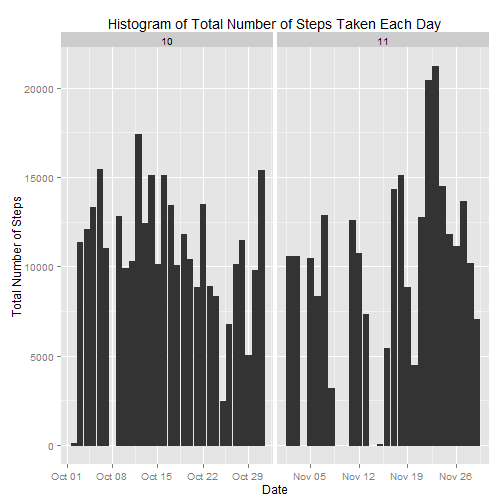
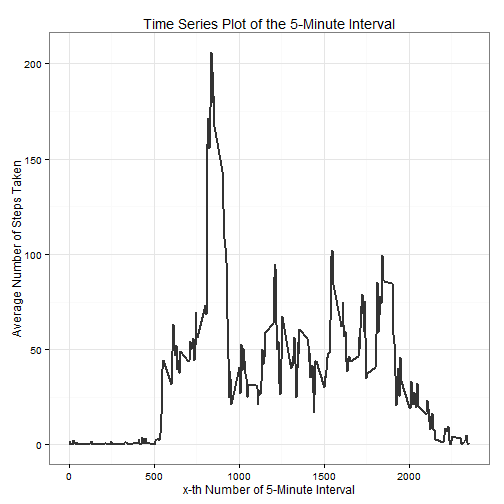
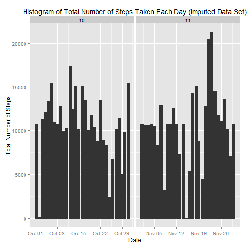
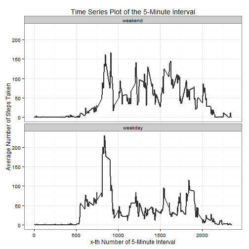

# Reproducible Research: Peer Assessment 1

With the following option I will disable the scientific number formatting and set the date to English.

```r
options(scipen = 1)
Sys.setlocale("LC_TIME", "English")
```

```
## [1] "English_United States.1252"
```

## Loading and preprocessing the data


This assignment makes use of data from a personal activity monitoring device. This device collects data at 5 minute intervals through out the day. The data consists of two months of data from an anonymous individual collected during the months of October and November, 2012 and include the  number of steps taken in 5 minute intervals each day.

First of all, I will read the data file and format the columns. In addition, I will create a second data set which excludes observations with missing data.


```r
library(ggplot2)
unzip("activity.zip")
```

```
## Warning in unzip("activity.zip"): error 1 in extracting from zip file
```

```r
fileName <- "activity.csv"
activityData <- read.csv(fileName,
                          header=TRUE,
                          colClasses = c("integer", "Date", "factor"))

activityData$month <- as.numeric(format(activityData$date, "%m"))

obsWithNoMissingValues <- complete.cases(activityData)
activityDataClean <- activityData[obsWithNoMissingValues, ]
```


```r
activityData.dim <- dim(activityData)
```

The original data set has a dimension of 17568, 4.


```r
activityDataClean.dim <- dim(activityDataClean)
```

The cleaned data set without missing values has a dimension of 15264, 4.


## What is mean total number of steps taken per day?


Make a histogram of the total number of steps taken each day.


```r
ggplot(activityDataClean, aes(date, steps)) + 
  geom_bar(stat = "identity", colour = "#333333", fill = "#333333", width = 0.8) + 
  facet_grid(. ~ month, scales = "free") + 
  labs(title = "Histogram of Total Number of Steps Taken Each Day", 
       x = "Date", 
       y = "Total Number of Steps")
```

 


Calculate and report the mean and median of the total number of steps taken per day.


```r
totalNumberofSteps          <- aggregate(activityDataClean$steps, 
                                  list(Date = activityDataClean$date), 
                                  FUN = "sum")$x
meanOfTotalNumberofSteps    <- mean(totalNumberofSteps)
meanOfTotalNumberofSteps
```

```
## [1] 10766.19
```

```r
medianOfTotalNumberofSteps  <- median(totalNumberofSteps)
medianOfTotalNumberofSteps
```

```
## [1] 10765
```

The **mean** of the total number of steps taken per day is **10766** while the **median** of the total number of steps taken per day is **10765**.


## What is the average daily activity pattern?

Make a time series plot (i.e. type = "l") of the 5-minute interval (x-axis) and the average number of steps taken, averaged across all days (y-axis)


```r
avgStepsMatrix <- aggregate(activityDataClean$steps, 
                          list(interval = as.numeric(as.character(activityDataClean$interval))), 
                          FUN = "mean")
names(avgStepsMatrix)[2] <- "meanOfStepsTaken"

ggplot(avgStepsMatrix, aes(interval, meanOfStepsTaken)) + 
  geom_line(color = "#333333", size = 0.8) + 
  labs(title = "Time Series Plot of the 5-Minute Interval", 
       x = "x-th Number of 5-Minute Interval", 
       y = "Average Number of Steps Taken") + 
  theme_bw()
```

 

Which 5-minute interval, on average across all the days in the dataset, contains the maximum number of steps?


```r
maxStepsTaken       <- max(avgStepsMatrix$meanOfStepsTaken)
maxStepsTakenMatrix <- avgStepsMatrix[avgStepsMatrix$meanOfStepsTaken == maxStepsTaken, ]
maxStepsTakenMatrix
```

```
##     interval meanOfStepsTaken
## 104      835         206.1698
```

The **835** *th* 5-minute interval contains the maximum number of 206 steps.


## Imputing missing values

Calculate and report the total number of missing values in the dataset (i.e. the total number of rows with NAs)


```r
numberOfObservationsWithMissingValues <- sum(!obsWithNoMissingValues)
numberOfObservationsWithMissingValues
```

```
## [1] 2304
```

There are **2304** observations with missing values.


Devise a strategy for filling in all of the missing values in the dataset. The strategy does not need to be sophisticated. For example, you could use the mean/median for that day, or the mean for that 5-minute interval, etc.

I will attempt to fill all missing values in the data set with the rounded average number of steps at a given 5-minute interval across the number of days for which data is available.


Create a new dataset that is equal to the original dataset but with the missing data filled in.


```r
activityDataImputed <- activityData

for (i in 1:nrow(activityDataImputed)) {
    if (is.na(activityDataImputed$steps[i])) {
        activityDataImputed$steps[i] <- round(avgStepsMatrix[which(activityDataImputed$interval[i] == avgStepsMatrix$interval), ]$meanOfSteps, 0)
    }
}
```

Make a histogram of the total number of steps taken each day and Calculate and report the mean and median total number of steps taken per day. Do these values differ from the estimates from the first part of the assignment? What is the impact of imputing missing data on the estimates of the total daily number of steps?


```r
ggplot(activityDataImputed, aes(date, steps)) + 
  geom_bar(stat = "identity", colour = "#333333", fill = "#333333", width = 0.8) + 
  facet_grid(. ~ month, scales = "free") + 
  labs(title = "Histogram of Total Number of Steps Taken Each Day (Imputed Data Set)", 
       x = "Date", 
       y = "Total Number of Steps")
```

 


Calculate and report the mean and median of the total number of steps taken per day.


```r
totalNumberofStepsImp          <- aggregate(activityDataImputed$steps, 
                                  list(Date = activityDataImputed$date), 
                                  FUN = "sum")$x
meanOfTotalNumberofStepsImp    <- mean(totalNumberofStepsImp)
meanOfTotalNumberofStepsImp
```

```
## [1] 10765.64
```

```r
medianOfTotalNumberofStepsImp  <- median(totalNumberofStepsImp)
medianOfTotalNumberofStepsImp
```

```
## [1] 10762
```

```r
deltaOfMeanOfTotalNumberOfSteps <- meanOfTotalNumberofStepsImp - meanOfTotalNumberofSteps
deltaOfMeanOfTotalNumberOfSteps
```

```
## [1] -0.549335
```

```r
deltaOfMedianOfTotalNumberOfSteps <- medianOfTotalNumberofStepsImp - medianOfTotalNumberofSteps
deltaOfMedianOfTotalNumberOfSteps
```

```
## [1] -3
```

Both the **mean** of the total number of steps and the **median** of the total number of steps in the imputed data set is **smaller** (-0.549335 and -3, respectively) than in the data set with missing values.


## Are there differences in activity patterns between weekdays and weekends?

Create a new factor variable in the dataset with two levels – “weekday” and “weekend” indicating whether a given date is a weekday or weekend day.


```r
activityDataImputed$weekdays <- factor(format(activityDataImputed$date, "%A"))

levels(activityDataImputed$weekdays) <- list(weekend = c("Saturday", "Sunday"), 
                                             weekday = c("Monday", "Tuesday", 
                                                         "Wednesday", "Thursday", "Friday"))
summary(activityDataImputed$weekdays)
```

```
## weekend weekday 
##    4608   12960
```

Make a panel plot containing a time series plot (i.e. type = "l") of the 5-minute interval (x-axis) and the average number of steps taken, averaged across all weekday days or weekend days (y-axis). See the README file in the GitHub repository to see an example of what this plot should look like using simulated data.


```r
avgStepsMatrix <- aggregate(activityDataImputed$steps, 
                      list(interval = as.numeric(as.character(activityDataImputed$interval)), 
                           weekdays = activityDataImputed$weekdays),
                      FUN = "mean")
names(avgStepsMatrix)[3] <- "meanOfStepsTaken"


ggplot(avgStepsMatrix, aes(x = interval, y = meanOfStepsTaken)) + 
  geom_line(color = "#333333", size = 1) + 
  facet_wrap(~ weekdays, nrow = 2, ncol = 1) + 
  labs(title = "Time Series Plot of the 5-Minute Interval", 
       x = "x-th Number of 5-Minute Interval", 
       y = "Average Number of Steps Taken") + 
  theme_bw()
```

 


Judging from the illustration, the person seems to get up later on weekends than on weekdays. In addition, the individual is more active throughout the weekends compared to weekdays.
